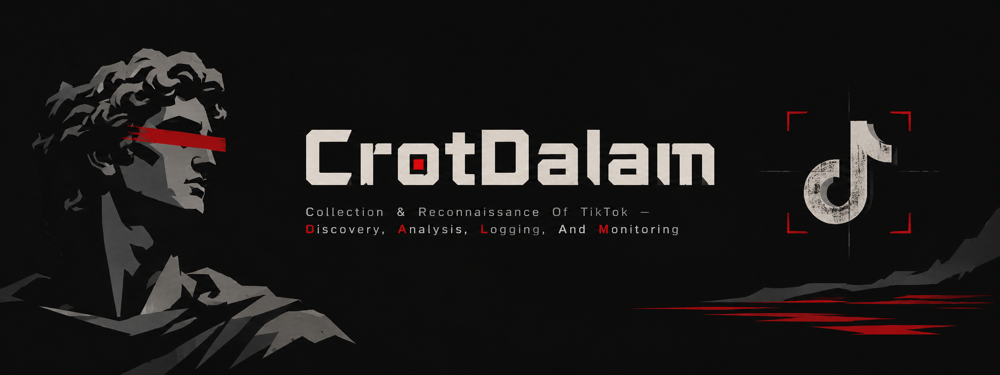

<p align="center">
  
</p>

<h1 align="center">CrotDalam</h1>

<p align="center">
  <strong>C</strong>ollection &amp; <strong>R</strong>econnaissance <strong>O</strong>f <strong>T</strong>ikTok —
  <strong>D</strong>iscovery, <strong>A</strong>nalysis, <strong>L</strong>ogging, <strong>A</strong>nd <strong>M</strong>onitoring
</p>

<p align="center">
  
  
  
  
  
</p>

---

A modular, **offline-first** reconnaissance framework for TikTok evidence work.
CrotDalam ingests captures you are authorized to hold, normalizes them into a
verifiable record contract, analyzes them with explainable heuristics, and
produces forensic-grade reports.

```
HAR capture ──▶ import ──▶ SQLite evidence DB ──▶ analyze ──▶ HTML / PDF / CSV / JSON
 (authorized)   (offline)   (source-hashed,        (selectors, (forensic report)
                             tamper-evident chain,   scam, coordination,
                             optional AES-256-GCM)   graph, temporal)
```

Four runtime dependencies (`beautifulsoup4`, `networkx`, `regex`,
`cryptography`); 79 tests, coverage 88% excluding the optional GUI.

---

## Read this first

CrotDalam is **not** a TikTok scraper and contains **no anti-bot bypass**.
There is no CAPTCHA solver, no request-signature generation (`X-Bogus`,
`msToken`, `_signature`), no proxy rotation for evasion, no device-fingerprint
spoofing and no decoy traffic. Those were deliberately left out — see
[`docs/SCOPE.md`](docs/SCOPE.md) for the reasoning and
[`docs/ROADMAP.md`](docs/ROADMAP.md) for what that means in practice.

What CrotDalam does instead is treat evidence you already lawfully hold as the
input, and do the analysis and reporting rigorously.

**Use only on data you are authorized to process.** See
[`docs/LEGAL-AND-ETHICS.md`](docs/LEGAL-AND-ETHICS.md).

---

## Install

```sh
git clone https://github.com/Masriyan/CrotDalam.git
cd CrotDalam
python -m venv .venv && source .venv/bin/activate
pip install -e ".[pdf]"
crotdalam --help
```

Full instructions, including running without installing: [`docs/INSTALL.md`](docs/INSTALL.md).

## Quick start

```sh
# 1. Inspect a capture without writing anything (sanitized metadata only)
crotdalam import-har capture.har --inspect

# 2. Import it into an evidence database
crotdalam import-har capture.har --database evidence.sqlite

# 3. Verify integrity + tamper-evident chain (checksums and evidence seal)
crotdalam validate --input evidence.sqlite

# 4. Pull pivotable selectors (URLs, @mentions, #tags, emails, phones, wallets)
crotdalam extract --input evidence.sqlite

# 5. Find accounts sharing captions or contact selectors (coordination)
crotdalam correlate --input evidence.sqlite --min-accounts 2

# 6. Descriptive counts
crotdalam analyze --input evidence.sqlite

# 7. Forensic reports in every format
crotdalam report --input evidence.sqlite --format all --output ./exports \
    --case-id CD-2026-001 --analyst "Your Name"
```

Measured on a real 144 MB / 1,696-entry capture: **156 records extracted in
0.93 s, 640 MB peak RSS**, then 142 hashtags, 33 mentions and a phone number
pivoted out with `extract`.

Full command reference: [`docs/USAGE.md`](docs/USAGE.md).

---

## What is in the box

### Collectors — [`docs/HAR-IMPORT.md`](docs/HAR-IMPORT.md)
- **HAR importer** (flagship): bounded, offline, allowlist-driven extraction of
  videos, profiles and comments from a browser capture. Redacts unknown hosts,
  path segments and JSON keys; discards query strings, headers and cookies.
- **Hydration collectors** for public profile/video pages, parsing embedded JSON
  (`SIGI_STATE`, `__UNIVERSAL_DATA_FOR_REHYDRATION__`, `__NEXT_DATA__`) — never
  `eval`. These require a transport engine that this release does not ship.
- **Imported collectors** for comments, followers, following and hashtags, which
  read local records only and refuse to invent an API.

### Analyzers — [`docs/ANALYZERS.md`](docs/ANALYZERS.md)
Nine offline, explainable engines plus a corpus→graph bridge. Every one returns
evidence and an explicit `uncertainty` list, and none claims to be a probability
or a determination:
- Per-record: `ScamDetector` (bilingual, tuned for Indonesian TikTok fraud),
  `PhishingDetector`, `BotDetector`, `EngagementAnalyzer`, `SentimentAnalyzer`,
  `TemporalAnalyzer`.
- Cross-corpus OSINT: `SelectorExtractor` (URLs, @mentions, #hashtags, emails,
  phones, crypto wallets, messaging handles — the pivot points),
  `CoordinationAnalyzer` (accounts sharing captions or contact selectors),
  `NetworkAnalyzer` fed by `graph_from_corpus` (authorship/interaction graph).

### Search — [`docs/SEARCH.md`](docs/SEARCH.md)
`KeywordSearch`, `FuzzySearch` (bounded edit distance), `RegexSearch`
(timeout-guarded) and `BulkSearch` over a local corpus.

### Monitors — [`docs/MONITORS.md`](docs/MONITORS.md)
Persistent change detection for profiles, keywords, hashtags and livestreams,
with event-time staleness handling and alert deduplication.

### Reports — [`docs/REPORTS.md`](docs/REPORTS.md)
HTML (self-contained, script-free, CSP-locked, printable), PDF, CSV (BOM +
formula-injection protection) and JSON (schema v1.0).

### Storage — [`docs/STORAGE.md`](docs/STORAGE.md)
SQLite in WAL mode, `0600` permissions, per-record SHA-256 checksums, a
**tamper-evident hash chain** over the whole record log (HMAC-keyed when
encrypted), and optional AES-256-GCM encryption of values with the metadata
bound as AAD. Records carry the source capture's SHA-256 and a `collected_at`
distinct from the import time — see [`docs/DATA-MODEL.md`](docs/DATA-MODEL.md).

---

## Documentation

| Document | Contents |
|---|---|
| [`docs/INDEX.md`](docs/INDEX.md) | Map of all documentation |
| [`docs/INSTALL.md`](docs/INSTALL.md) | Installation, optional extras, verification |
| [`docs/USAGE.md`](docs/USAGE.md) | Every command, flag and exit code |
| [`docs/ARCHITECTURE.md`](docs/ARCHITECTURE.md) | Module layout and data flow |
| [`docs/SCOPE.md`](docs/SCOPE.md) | What is in scope, what is excluded and why |
| [`docs/HAR-IMPORT.md`](docs/HAR-IMPORT.md) | HAR ingestion, limits, redaction model |
| [`docs/DATA-MODEL.md`](docs/DATA-MODEL.md) | Record contract and report schema |
| [`docs/ANALYZERS.md`](docs/ANALYZERS.md) | Nine analyzers, weights, selectors, coordination, graph |
| [`docs/MONITORS.md`](docs/MONITORS.md) | Change detection and alert semantics |
| [`docs/SEARCH.md`](docs/SEARCH.md) | Corpus search engines and bounds |
| [`docs/REPORTS.md`](docs/REPORTS.md) | Output formats and their guarantees |
| [`docs/STORAGE.md`](docs/STORAGE.md) | Database, checksums, encryption |
| [`docs/CONFIGURATION.md`](docs/CONFIGURATION.md) | Settings and `CROTDALAM_*` variables |
| [`docs/QA-REPORT.md`](docs/QA-REPORT.md) | Audit findings, fixes and open items |
| [`docs/TESTING.md`](docs/TESTING.md) | Running tests, coverage, adding cases |
| [`docs/TROUBLESHOOTING.md`](docs/TROUBLESHOOTING.md) | Errors and what they mean |
| [`docs/FAQ.md`](docs/FAQ.md) | Common questions |
| [`docs/ROADMAP.md`](docs/ROADMAP.md) | Planned work and explicit non-goals |
| [`docs/LEGAL-AND-ETHICS.md`](docs/LEGAL-AND-ETHICS.md) | Authorization, privacy, retention |
| [`SECURITY.md`](SECURITY.md) | Reporting vulnerabilities, threat model |
| [`CONTRIBUTING.md`](CONTRIBUTING.md) | Development workflow and standards |
| [`CHANGELOG.md`](CHANGELOG.md) | Release history |

---

## Project status

Working today, fully offline: `import-har`, `validate`, `extract`, `correlate`,
`analyze --input`, `report`, `config`, `session`, `proxy`, `shell`, and every
analyzer, monitor, search and report module as a library API.

Not available in this release: `search`, `analyze --username`, `crawl`,
`monitor` and `gui`, because they need a collection engine
(`crotdalam.core.engine`) which is not shipped. Building an anti-bot bypass to
reach TikTok's private endpoints — CAPTCHA solving, request-signature forging,
evasion proxying, fingerprint spoofing — is a deliberate, permanent non-goal;
[`docs/SCOPE.md`](docs/SCOPE.md) explains why, including why it would undermine
the forensic value of the evidence. These commands fail immediately with an
explanation rather than a traceback. Supply your own lawful transport and
everything downstream works unchanged.

---

## License

MIT — see [`LICENSE`](LICENSE).
